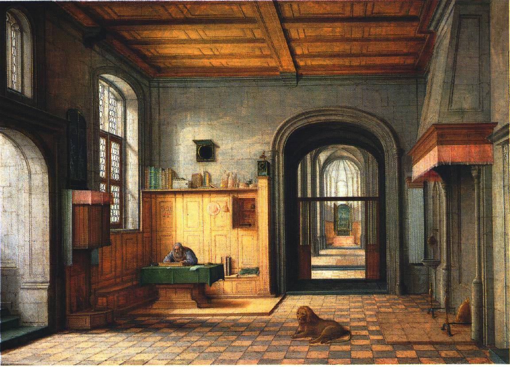
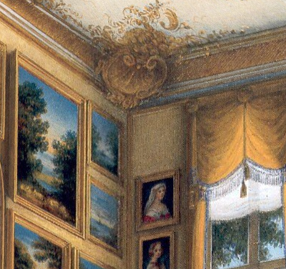

# **Tour into the Picture**

## Overview

The goal of this project is to create a simple, planar 3D scene from a single photograph using the prospective transformation.

### input images

        <figcaption>Sjerome</figcaption>    <figcaption>Salon</figcaption>    <figcaption>Antechamber</figcaption> 

## Modeling the 3D background

Using the user constraints ("inner rectangle" and the vanishing point), I will divide the image into five parts: ceiling, floor, left wall, right wall, and the rear wall. This step is done by the given starter code. Below are the image division setup (more examples will be attached later).

        <figcaption>Sjerome with user constraints</figcaption> 

        <figcaption>Sjerome with five parts</figcaption> 

## Rendering the 3D scene

To make the final 3D image, I first define the 3D coordinates of each part of the image. I use the rear wall as  one surface of the 3D box and the height is set to 1. Then, I use the ratio between the width of the rear wall and the height of the rear wall to determine the length of the box. The position of that surface can be well determined. To determine the depth of each other four part, I use similar triangles. For example, to calculate the depth of the floor, I use the ratio between the parallel lines of the trapezoid, and it is exactly the ratio between focal length and focal length plus the depth. I arbitrarily set the focal length (it is relative to the size of the 3D box), and all the depths can be solved. Finally, I use my good old friend homography to  warp each part (except the rear wall which is already rectified) of the image to a full 2D image and then use Matlab's warp function to warp it to a surface of my 3D box. The final 3D box is irregular since some parts are extended. Below are some images when I tour into the picture (move and rotate the camera in Matlab figure).

        <figcaption>Sjerome 3D box</figcaption>     <figcaption>Sjerome inside the box</figcaption>     <figcaption>Sjerome inside the box</figcaption> 

I can construct something 2D to 3D thanks to the prospective projections! It gives you a different perspective from you looking at the planar image.

Below are some other examples when I walk into the picture.

        <figcaption>Salon with user constraints</figcaption>     <figcaption>Salon with five parts</figcaption>     <figcaption>Salon inside the box</figcaption>     <figcaption>Salon inside the box</figcaption>

        <figcaption>Antechamber with user constraints</figcaption>     <figcaption>Antechamber with five parts</figcaption>     <figcaption>Antechamber inside the box</figcaption>     <figcaption>Antechamber inside the box</figcaption>

## Bells & Whistles

### Foreground Modeling

First, I add user constraint on selecting the rectangles each containing one foreground object. Then I use Matlab's grabcut function to create a mask for the foreground object and use inpaintExemplar function to inpaint the foreground object so that it is no longer a part of the background image. Below are the results.

        <figcaption>Sjerome with lion selected</figcaption>    <figcaption>Sjerome with lion inpainted</figcaption>

To add the foreground objects back to my 3D model, I need to create individual plane for each of them. The big assumption is that they all stand on the floor, which means all the planes are perpendicular to the floor plane I constructed earlier. To calculate the 3D position and size of the plane, I use similar triangles again. Below are some images with foreground objects at different angles.

     <figcaption>Lion angle 1</figcaption>     <figcaption>Lion angle 2</figcaption>    <figcaption>Lion angle 3</figcaption>    <figcaption>Lion angle 4</figcaption> 

You can also select more than one object and add them back at the end!

The object selection process can be further improved if there is a better function than grabcut or I customize the selection region instead of limiting it to rectangle. However, the result is pretty good now.

### Movie Fly-through

I use Matlab's camdolly function to change the camera position (zoom in and out, move left or right), view function to change camera's line of sight (rotate horizontally). After collecting all the frames using getframe function, I use VideoWriter to create a video. Abracadabra!

 <iframe width="600" height="600" src="https://www.youtube.com/embed/sIKMEUHS8tE"> </iframe> 

## Summary

This project gives me an interesting perspective of viewing the arts. Also, similar triangles remind me of the old days in my middle school lol.

## Reference

1. Antechamber from https://raw.githubusercontent.com/yli262/tour-into-the-picture/master/image/antechamber.jpg
2. Salon from https://raw.githubusercontent.com/yli262/tour-into-the-picture/master/image/Stadtschloss_Gelber_Salon.jpg
