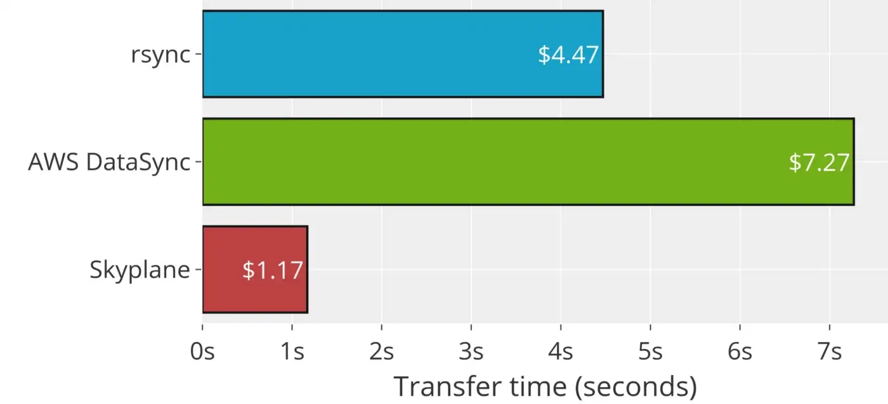
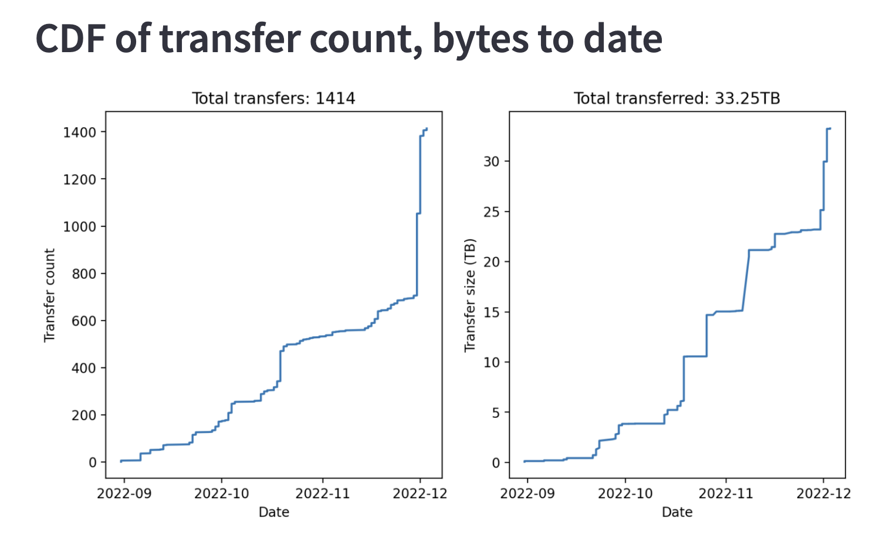
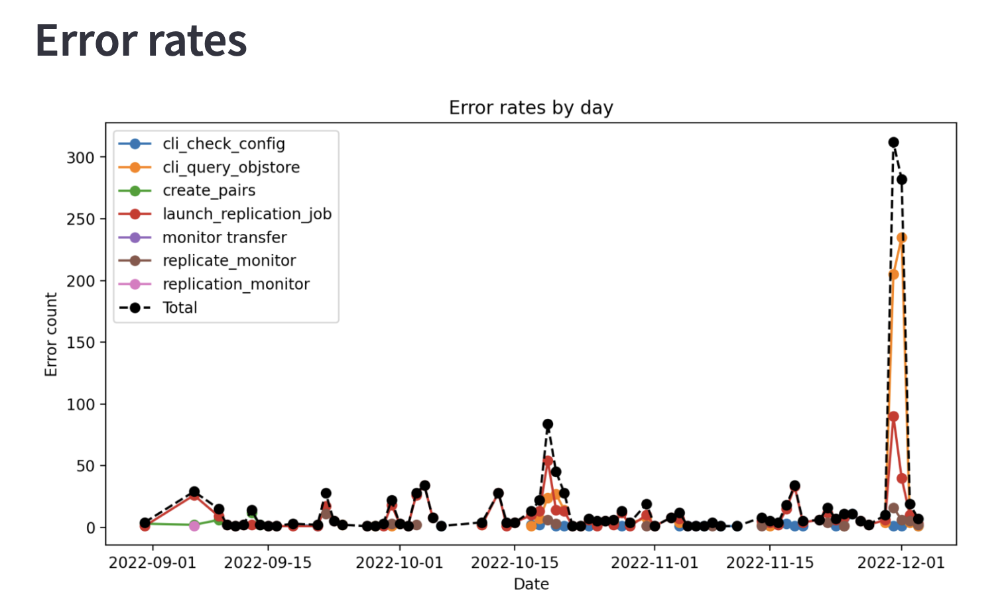

# Skyplane: 110x faster data transfers on any cloud

At Sky Lab, I am working on the [Skyplane](https://skyplane.org/en/latest/) project, a tool for blazingly fast bulk data transfers in the cloud. Here are my contributions so far

## Benchmark Results

I showed that Skyplane is up to 110x faster and 84% lower cost than any existing cloud transfer tools such as AWS DataSync, Google Cloud Data Transfer, and Azure Data Transfer.

The results were contributed to [Skyplane NSDI 2023 submission](https://www.usenix.org/conference/nsdi23/presentation/jain) and [blog post](https://medium.com/@paras_jain/skyplane-110x-faster-data-transfers-on-any-cloud-8f0165c1d711). Below is one of the plots.

        <figcaption>When transferring a 220GB Wikipedia dump, Skyplane is 3.8x cheaper than rsync and 6.2x cheaper than AWS DataSync</figcaption>

## Continuous Profiling

I implemented a real-time dashboard of the public cloud internet activities related to Skyplane. Below are two of the plots (up to 12/01/2022).

    

    

## Training an ML model with Skyplane

After implementing Skyplane API, I designed a use case of Skyplane about transfering data between S3 buckets and streamlizing it directly to the ML model.

Detailed instructions are [here](https://github.com/skyplane-project/skyplane/tree/main/examples).

